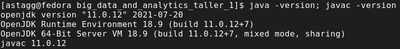
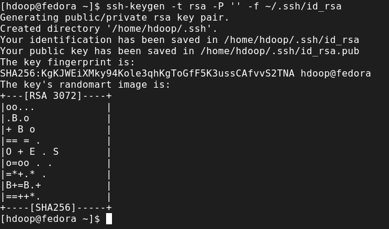
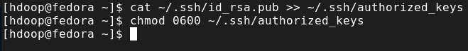
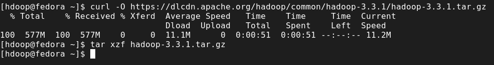

# Taller 1

Taller #1 para la electiva profesional Big Data & Analytics de la Universidad El Bosque

**Estudiante:** Álvaro Stagg
**Profesor:** Fabian Peña

## Parte 1

En esta sección del taller se realizó la instalación de una máquina virtual
utilizando VMware como software de virtualización y la versión 34 de la
distribución de Fedora.

### Instalación del OpenJDK

Para instalar una versión libre de la máquina virtual de Java se eligió OpenJDK
y se instaló utilizando el siguiente comando:

```sh
$ sudo dnf install java-11-opendk-devel
```



### Creación y Preparación de Usuario SSH

Primero se creó un usuario llamado `hdoop` y se le asignó una contraseña.
Luego, autenticado como este usuario, se generó una llave SSH utilizando el
siguiente comando:

```sh
sh-keygen -t rsa -P '' -f ~/.ssh/id_rsa
```



Después de obtener la llave, se añadió a la lista de claves autorizadas y se le
cambió el permiso al archivo por un `0600`.



### Descarga de Hadoop

Primero, se descargó la versión 3.3.1 de Hadoop desde la [página oficinal del
proyecto](https://hadoop.apache.org/) utilizando la herramienta `cURL`:

```sh
$ curl -O https://dlcdn.apache.org/hadoop/common/hadoop-3.3.1/hadoop-3.3.1.tar.gz
```

Luego se descomprimió utilizando el comando `tar xzf hadoop-3.3.1.tar.gz`.



### Configuración de Hadoop

Para instalar Hadoop en modo pseudo-distribuido, se modificó el archivo `.bashrc`
que está presenten el el directorio `$HOME` del usuario `hdoop`. El archivo
quedó de la siguiente manera:


