# Taller 1

Taller #1 para la electiva profesional Big Data & Analytics de la Universidad El Bosque

**Estudiante:** Álvaro Stagg  
**Profesor:** Fabian Peña

## Parte 1

En esta sección del taller se realizó la instalación de una máquina virtual
utilizando VMware como software de virtualización y la versión 34 de la
distribución de Fedora.

### Instalación del OpenJDK

Para instalar una versión libre de la máquina virtual de Java se eligió OpenJDK
y se instaló utilizando el siguiente comando:

```sh
$ sudo dnf install java-11-opendk-devel
```


### Creación y Preparación de Usuario SSH

Primero se creó un usuario llamado `hdoop` y se le asignó una contraseña.
Luego, autenticado como este usuario, se generó una llave SSH utilizando el
siguiente comando:

```sh
sh-keygen -t rsa -P '' -f ~/.ssh/id_rsa
```


Después de obtener la llave, se añadió a la lista de claves autorizadas y se le
cambió el permiso al archivo por un `0600`.


### Descarga de Hadoop

Primero, se descargó la versión 3.3.1 de Hadoop desde la [página oficinal del
proyecto](https://hadoop.apache.org/) utilizando la herramienta `cURL`:

```sh
$ curl -O https://dlcdn.apache.org/hadoop/common/hadoop-3.3.1/hadoop-3.3.1.tar.gz
```

Luego se descomprimió utilizando el comando `tar xzf hadoop-3.3.1.tar.gz`.


### Configuración de Hadoop

Para instalar Hadoop en modo pseudo-distribuido, se modificó el archivo `.bashrc`
que está presenten el el directorio `$HOME` del usuario `hdoop`. El archivo
quedó de la siguiente manera:

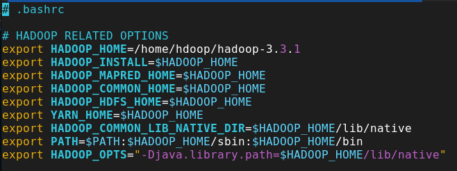

El siguiente paso es indicarlo a Hadoop qué versión de Java debe utilizar para
ejecutarse. Para ello, se editó el archivo `hadoop-env.sh`, específicamente
la siguiente linea:

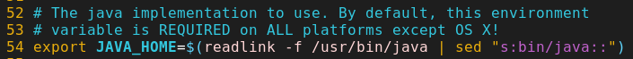

El próximo archivo que se modificó fue el archivo `core-site.xml` el cual
quedó de la siguiente forma:

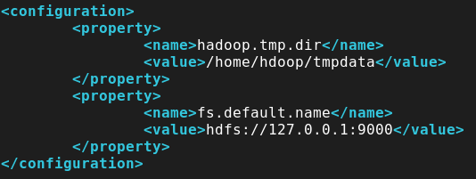

El siguiente archivo que se modificó fue `hdfs-site.xml` el cual quedó de la
siguiente manera:

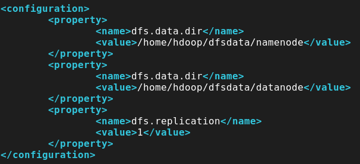

En la anterior configuración se indicó utilizar dos directorios que no existen,
por ende se deben crearon utilizando los siguientes comandos:

```sh
$ mkdir -p $HOME/dfsdata/namenode
$ mkdir -p $HOME/dfsdata/datanode
```

Luego, se indicó a Hadoop cuál framework de MapReduce utilizar, para este taller
se utilizará `yarn`. Esto se consigue editando el archivo `mapred-site.xml` de
la siguiente manera:

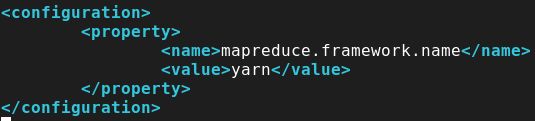

Lo siguiente es editar el archivo `yarn-site.xml` de la siguiente manera:

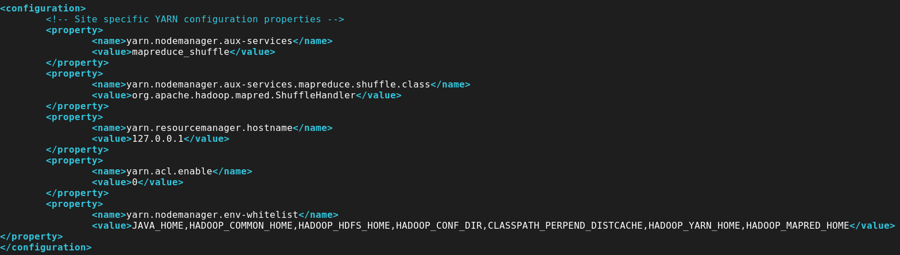

### Preparación del Sistema de Archivos

Una vez todas las configuraciones se aplicaron, se formateron los directorios
indicados para el uso de Hadoop utilizando el siguiente comando:

```sh
hdfs namenode -format
```

El output de este comando es demasiado largo pero sabemos que se ejecutó con
éxito gracias a su mensaje final.

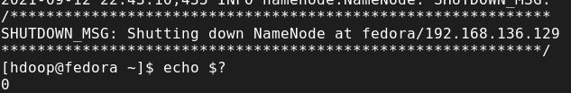

### Inicialización del Cluster

Para iniciar el cluster previamente configurado de Hadoop se ejecutó el archivo
`start-dfs.sh` dentro del directorio `sbin/` contenido en el directorio descomprimido
de Hadoop.

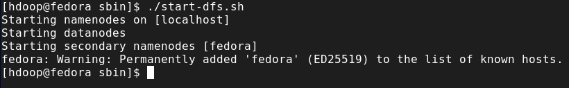

### Preparación De Nodos

Para inicializar los nodos, se utiliza el script `start-yarn.sh` presente en el
directorio `sbin/` contenido en el directorio descomprimido de Hadoop.

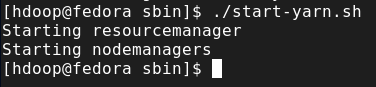

Se puede observar que todo levantó de manera satisfactoria ejecutando el comando `jps`:

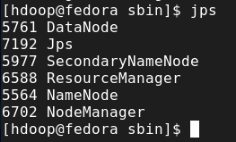

### Monitoreo de Hadoop en Navegador

En las siguientes imágenes se puede apreciar los diferentes paneles que habilita la suite
de Hadoop para el monitoreo de tareas, sistema de archivos, aplicaciones, etc.

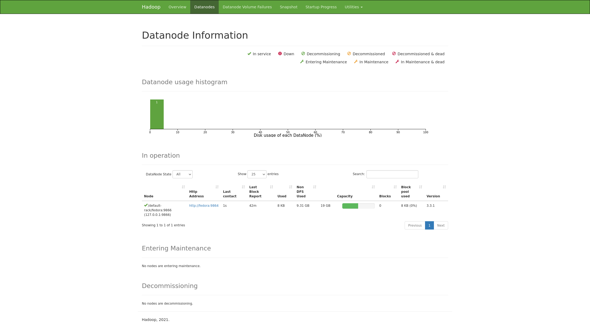
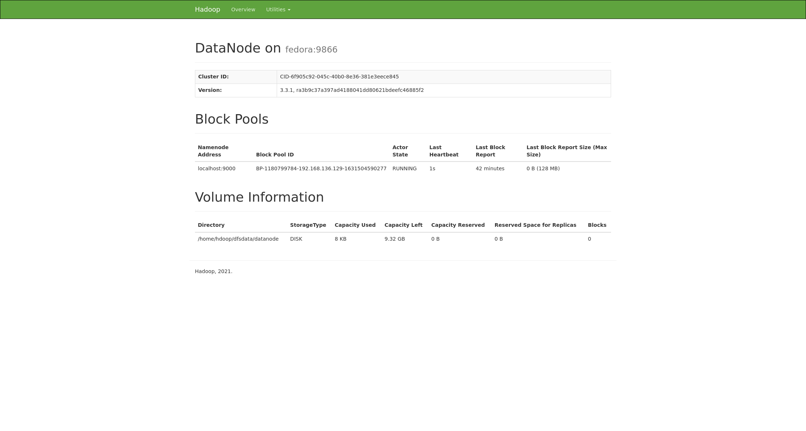
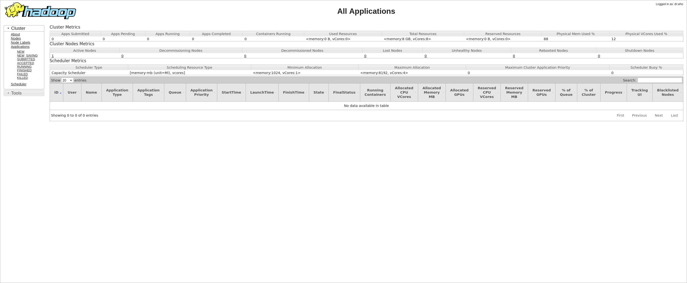

## Parte 2

Para esta parte del taller se ejecutó un programa de ejemplo (MapReduce) incluido
en los archivos descargados de Hadoop. Para ejecutar este "job" es necesario seguir
la siguiente secuencia de comandos:

```sh
$ hdfs dfs -mkdir /user
$ hdfs dfs -mkdir /user/hdoop
$ hdfs dfs -mkdir input
$ hdfs dfs -put ./hadoop-3.3.1/etc/hadoop/*.xml input
$ hadoop jar ./hadoop-3.3.1/share/hadoop/mapreduce/hadoop-mapreduce-examples-3.3.1.jar grep input output 'dfs[a-z.]+'
```

Dado que el output de este programa es muy grande, no se puede adjuntar una captura completa,
embargo sé que se ejecutó con éxito por su output al final:

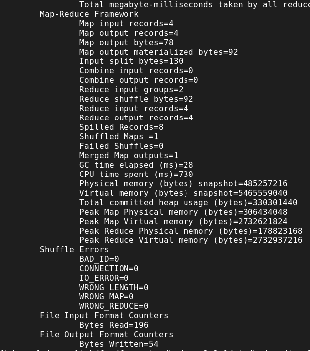

Además, se obtuvo el output del job desde el HDFS hacia el sistema de archivos local
y se puede constatar su correcta ejecución leyendo los archivos de salida:

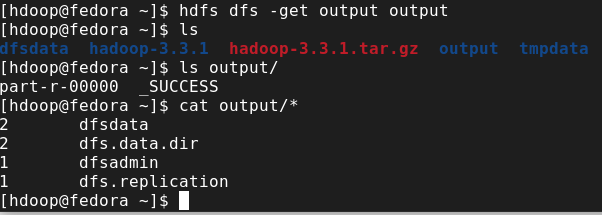

**Respuesta 1:** El MapReduce ejecutado anteriormente lee todos los archivos cargados en el directorio
input y sobre estos ejecuta la expresión regular `dfs[a-z.]+` la cuál buscará en todos estos archivos
cadenas de texto que cumplan con dicha expresión. Y no solo esto, además agregará un número entero
anterior a la cadena encontrada para indicar cuántas veces ha sido encontrada la cadena.

Para el siguiente ejercicio, cargaré un archivo de texto y ejecutaré el MapReduce de _WordCount_. La secuencia
de comandos es la misma que arriba, la única diferencia es cargar un archivo PDF en vez de archivos XML
y ejecutar el programa _WordCount_ en vez de _Grep_. Los comandos fueron

```sh
$ hdfs dfs -put enwik8 input
$ hadoop jar ./hadoop-3.3.1/share/hadoop/mapreduce/hadoop-mapreduce-examples-3.3.1.jar wordcount input/enwik8 output/enwik8
```


Dado que el output de esta ejecución es muy larga, no se puede mostrar en una captura de pantalla completa, sin embargo
una parte sería:

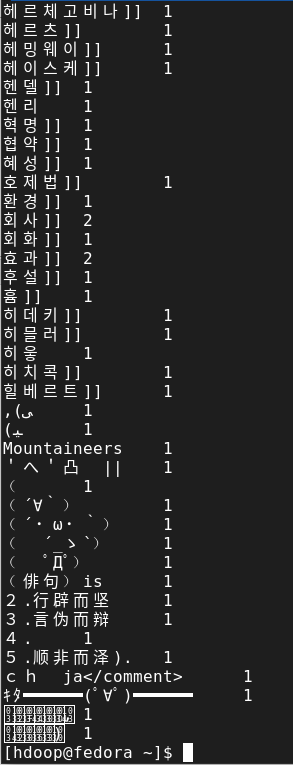

Como se puede apreciar, este MapReduce lo que hizo fue contar la cantidad de una misma palabra en el archivo
de entrada que le suministré, agregando un número a la derecha de cuántas veces apareció la respectiva
palabra en el archivo suministrado.

## Parte 3

Esta sección instalará la herramienta Spark en una máquina
virtual con Ubuntu Server 20.04.2 y ejecutaré el ejemplo
de WordCount dentro del servidor Spark.


### Preparación del Servidor

Para iniciar, se instala el compilador del lenguaje de
programación Scala y todas las dependencias necesarias.
Además se instala el programa git para el versionamiento
de archivos. Para instalarlo se hizo con el siguiente comando:

```sh
$ sudo apt install scala git
```

Para ver que tengo todo lo necesario para instalar y
ejecutar Spark ejecutaré los siguientes comandos y
todos deberían responder de manera satisfactoria.

```sh
$ java -version; javac -version; scala -version; git --version
```

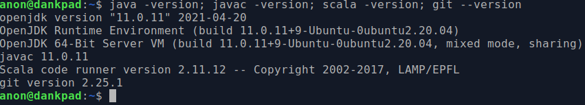

### Descarga e Instalación de Spark

Con la ayuda de `curl` descargué la última versión disponible
de Spark desde la página web oficial de proyecto.

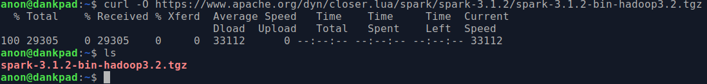

Luego, procedí a descomprimir el archivo descargado y mover
el directorio resultante a `/opt/spark`. Además, preparé
las variable de entorno necesarias para ejecutar Spark.

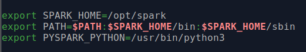

### Iniciar Maestro de Spark

Con el comando `start-master.sh` he inicializado el servidor
maestro de Spark. Si ingreso a `http://localhost:8080` podré
visualizar el panel maestro de Spark.

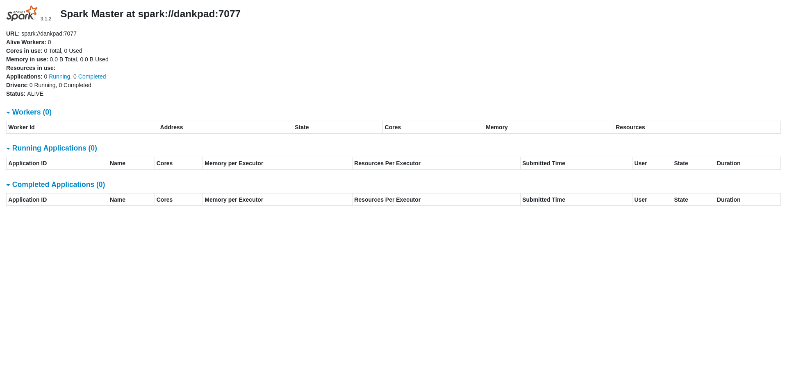

### Iniciar Esclavo de Spark

En este escenario, tanto maestro como esclavo fueron ejecutados
en el mismo servidor. Para iniciar un esclavo bastó con ejecutar
el comando `start-slave.sh spark://dankpad:7077`. Se puede ver
que el esclavo levantó correctamente porque apareció en el panel
maestro.

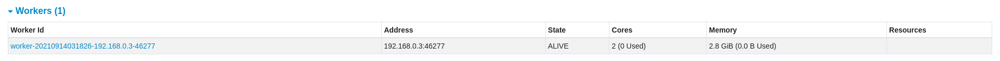

### Ingreso a Terminal de Spark

Por último, para ingresar a la terminal de Spark, ingresé el comando `pyspark`.

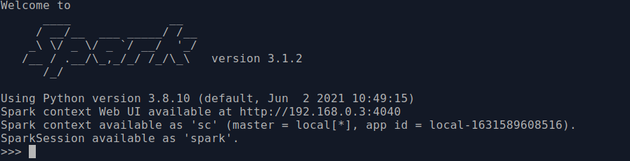

### Ejecución de Word Count

Para ejecutar el ejemplo `wordcount.py` descargué un archivo _lorem ipsum_
y lo inserté al contexto de aplicación de Spark, a su vez indiqué cuál era
mi servidor maestro y qué script debería correr. El comando completo sería:

```sh
$ pyspark --master spark://dankpad:7077 --name bigDataWC --py-files /opt/spark/examples/src/main/python/wordcount.py --files ./sample-text-file.txt
```

Se puede ver a la aplicación corriendo en el panel de Spark:

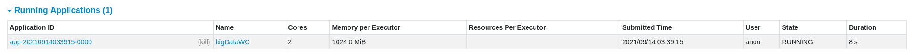

Tarea terminada:

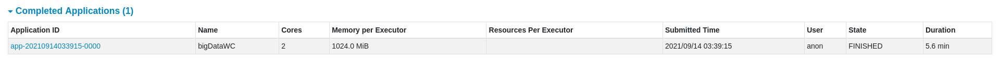

## Parte 4

En esta sección, descargaremos e instalaremos Anaconda en la misma máquina
virtual donde he estado trabajando la sección anterior. Posteriormente,
inicializaremos un entorno Jupyter y ejecutaremos los archivos provistos
por el profesor en el enunciado del taller.

### Descargar e Instalar Anaconda

Primero, se debe descargar el instalador utilizando el siguiente comando:

```sh
$ curl -O https://repo.anaconda.com/archive/Anaconda3-2021.05-Linux-x86_64.sh
```

Luego, ejecutaremos el comando con `bash Anaconda3-2021.05-Linux-x86_64.sh`. El
output de este instalador es muy largo pero en la siguiente captura se evidencia
su instalanción correctamente:

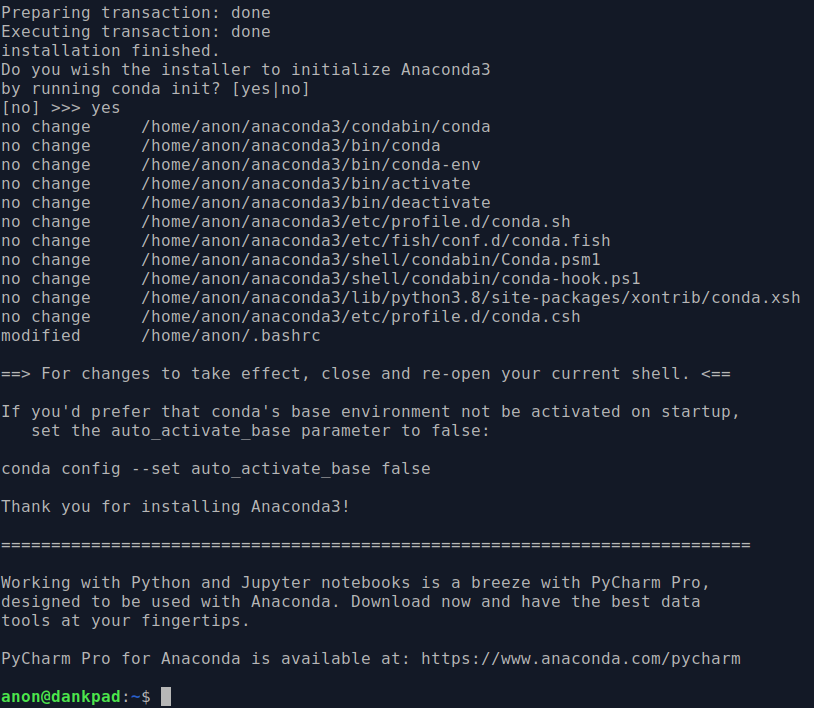

### Inicializar Jupyter

Una vez se instaló Anaconda, se inició una nueva instancia de Jupyter
utilizando el comando `jupyter lab --ip=0.0.0.0`. Si se ingresa a la URL que
me dió se puede observar el panel de Jupyter:

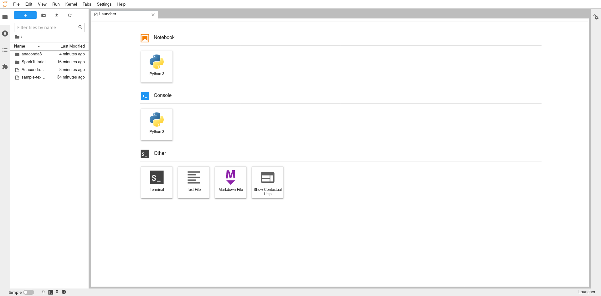